---
# Slide 1 : Minerve.fr
### Hackathon Assemblée Nationale 2026
**Thématique : France 2030 – Analyse prospective des Stratégies Nationales d’Accélération (SNA)**

**Créer le lien entre le vote du budget, l'écosystème économique et l'attention parlementaire.**

**Liens utiles :**
* 🌐 **Application (Démonstrateur)** : [Insérer l'URL de l'application ici]
* 📊 **Données & Datasets** : [Insérer l'URL des datasets ici]
* 💻 **Code source** : [Insérer le lien Github ici]

---

# Slide 2 : Le Constat
### La complexité du suivi budgétaire
* **Décalage** : Il est difficile de suivre l'impact réel des grands plans d'investissement (ex: France 2030) une fois le budget voté.
* **Silos de données** : Les informations budgétaires, économiques (brevets, créations d'entreprises) et parlementaires (débats, questions) sont déconnectées.
* **Besoin de clarté** : Les décideurs et les citoyens ont besoin d'outils institutionnels sobres pour visualiser concrètement l'action publique.

**Idée image/DataViz** : visuel en 3 silos verticaux non connectés (`Budget`, `Entreprises / brevets`, `Parlement`) avec des flèches manquantes ou pointillées pour montrer la rupture actuelle.

---

# Slide 3 : La Solution Minerve
### Un POC institutionnel, clair et modulaire
* **Inspiration** : Interface sobre calquée sur les standards de l'État (`sites.beta.gouv.fr`).
* **Objectif** : Transformer des données complexes en rapports visuels lisibles et actionnables.
* **Approche** : Un socle technique robuste prêt à ingérer de multiples sources de données publiques en open data.

**Idée image/DataViz** : pipeline horizontal `Sources publiques` → `Dataset JSON structuré` → `Score / dataviz` → `Rapport par programme`, avec une icône ou couleur par famille de données.

---

# Slide 4 : Ce que fait le POC aujourd'hui
### Les fonctionnalités cœur (Démonstrateur)
* **Vue globale** : Liste complète des investissements (focus actuel sur France 2030).
* **Dataviz macro** : Visualisation de la répartition budgétaire (ex: budgets 2026) via des graphiques clairs.
* **Rapports automatiques** : Génération d'une page type "Slide de présentation" pour chaque programme, résumant les indicateurs clés.

**Idée image/DataViz** : triptyque de captures ou wireframes : `Landing page` → `Liste des investissements + camembert` → `Rapport slide programme 424`.

---

# Slide 5 : L'Architecture Technique
### Prêt pour la mise à l'échelle
* **Stack moderne** : Next.js App Router (Node 24), TypeScript strict.
* **UI/UX** : Utilisation de Mantine pour les composants et la DataViz (camemberts, tables), dans un esprit d'accessibilité et de sobriété.
* **Gestion des données** : Mocks structurés dans `dataset/`, exposés au front par une façade typée (`src/data/investments.ts`) pour remplacer facilement les données fictives par de vraies sources.

**Idée image/DataViz** : diagramme d'architecture simple : `dataset/*.json` en bas, `src/data/investments.ts` comme couche de normalisation, puis les routes `/`, `/investissements`, `/investissements/[programmeCode]`.

---

# Slide 6 : Les Données Cibles (L'Écosystème)
### Connecter le budget à la réalité du terrain
Pour passer du POC à la version finale, Minerve connectera :
* **Innovation** : INPI (dépôts de brevets par domaine).
* **Économie** : INSEE / base Sirene (dynamique des entreprises, codes NAF, effectifs, chiffre d'affaires).
* **Open Data** : data.gouv.fr pour les jeux de données publics associés.

**Idée image/DataViz** : matrice `source x usage` avec lignes `INPI`, `Sirene`, `CA`, `data.gouv.fr` et colonnes `brevets`, `entreprises`, `emplois`, `territoires`, `CA`; remplir les cellules par un score de couverture.

---

# Slide 7 : Le Croisement Parlementaire
### L'attention de la représentation nationale
Minerve ne regarde pas que l'économie, mais aussi le débat démocratique :
* **Sources** : Assemblée nationale, Sénat, et outils comme Tricoteuses / Canutes.
* **Signaux** : Analyse des débats, rapports, et questions au gouvernement.
* **Objectif** : Mesurer l'intérêt et la pression parlementaire sur chaque programme d'investissement.

**Idée image/DataViz** : frise chronologique croisant `votes budgétaires`, `questions`, `rapports`, `débats`, avec une couleur par source Assemblée / Sénat / Tricoteuses.

---

# Slide 8 : L'Indicateur Clé
### Le Score d'Alignement
L'innovation majeure de Minerve est de créer un **score d'alignement** croisant 3 dimensions :
1. **L'effort budgétaire** (L'argent investi).
2. **La dynamique de l'écosystème** (Les brevets, les entreprises, les emplois et le chiffre d'affaires).
3. **L'attention parlementaire** (Le volume et la teneur des débats).
*Permet de détecter les angles morts (beaucoup de budget, peu d'impact) ou les réussites fulgurantes.*

**Idée image/DataViz** : jauge ou radar à 5 axes (`Budget`, `Brevets`, `Entreprises`, `Territoires`, `Parlement`) complétée par un quadrant `budget élevé/faible` vs `signaux terrain forts/faibles`.

---

# Slide 9 : BONUS - Au-delà de France 2030 (La Vision)
### Un outil de Rétrospective Budgétaire Globale
France 2030 n'est qu'un point de départ. Minerve a vocation à :
* **Explorer d'autres thématiques** : Transition écologique, Défense, Santé, etc., à partir de n'importe quel Projet de Loi de Finances (PLF).
* **Nouvelles DataViz** : Cartographies territoriales (où va l'argent vs où se crée l'emploi), frises chronologiques croisant l'agenda parlementaire et le décaissement des fonds.
* **IA & Sémantique** : Utiliser des LLMs et des embeddings pour faire matcher automatiquement des lignes budgétaires obscures avec des secteurs économiques réels.

**Idée image/DataViz** : carte de France en couches superposées : `budget par territoire`, `emplois`, `brevets`, `mentions parlementaires`, avec un sélecteur de thématique PLF.

---

# Slide 10 : Prochaines Étapes
### De la maquette au produit
1. **Branchement API** : Remplacement des mocks JSON par les connecteurs réels (API budgétaires, INPI, etc.).
2. **Moteur de matching** : Implémentation du matching sémantique, NAF et territorial.
3. **Exports** : Ajout d'une fonctionnalité d'export PDF des rapports pour utilisation directe en commission ou en cabinet.

**Idée image/DataViz** : roadmap en 3 colonnes `Données réelles`, `Matching`, `Export / usage métier`, avec une checklist visuelle et un indicateur de maturité par étape.

---

# Annexe UI : gabarit simple et icônes
### Notions visuelles à réutiliser dans les slides

## Gabarit majoritaire
* **Sidebar gauche** : icône principale en haut, titre court, 2 à 4 points clés maximum, pagination discrète en bas.
* **Contenu droite** : une dataviz, une capture, ou 2 à 3 cartes maximum. Éviter les compositions complexes.
* **Style** : fond blanc, typographie noire/grise, bleu France pour les liens et accents, rouge uniquement pour les alertes ou ruptures.
* **Icônes** : utiliser les SVG du dossier `icons/` dans le Markdown et `/icons/` côté site Next.

## Règle d'usage des icônes
* **1 icône forte en sidebar** pour donner le thème de la slide.
* **2 à 4 petites icônes maximum dans le contenu** pour identifier les blocs de données.
* **Aucune icône purement décorative** : chaque pictogramme doit porter une notion métier.
* **Taille recommandée** : 56-72 px pour la sidebar, 28-40 px dans les cartes.

## Mapping slide par slide

| Slide | Icône sidebar | Icônes de contenu | Notion visuelle |
|---|---|---|---|
| 1 - Minerve |  [innovation.svg](icons/innovation.svg) | 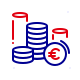 [money.svg](icons/money.svg) · 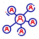 [ecosystem.svg](icons/ecosystem.svg) · 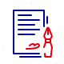 [contract.svg](icons/contract.svg) | Triangle `Budget` / `Écosystème` / `Parlement`, Minerve au centre. |
| 2 - Le Constat | 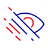 [eye-off.svg](icons/eye-off.svg) | 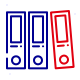 [binders.svg](icons/binders.svg) · 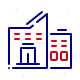 [companie.svg](icons/companie.svg) · 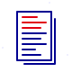 [document.svg](icons/document.svg) | Trois silos non connectés, avec flèches pointillées ou cassées. |
| 3 - Solution Minerve |  [data-visualization.svg](icons/data-visualization.svg) |  [catalog.svg](icons/catalog.svg) ·  [search.svg](icons/search.svg) · 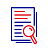 [document-search.svg](icons/document-search.svg) | Pipeline simple `Sources` → `Dataset` → `Score` → `Rapport`. |
| 4 - POC aujourd'hui |  [application.svg](icons/application.svg) |  [house.svg](icons/house.svg) ·  [data-visualization.svg](icons/data-visualization.svg) ·  [document-search.svg](icons/document-search.svg) | Triptyque `Landing` / `Liste + camembert` / `Rapport`. |
| 5 - Architecture technique | 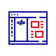 [coding.svg](icons/coding.svg) |  [catalog.svg](icons/catalog.svg) ·  [internet.svg](icons/internet.svg) ·  [application.svg](icons/application.svg) | Schéma en couches `dataset/` → façade typée → routes Next. |
| 6 - Données cibles |  [catalog.svg](icons/catalog.svg) |  [innovation.svg](icons/innovation.svg) ·  [companie.svg](icons/companie.svg) · 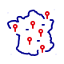 [location-france.svg](icons/location-france.svg) | Matrice `source x usage` avec score de couverture. |
| 7 - Croisement parlementaire | 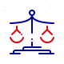 [justice-scales.svg](icons/justice-scales.svg) | 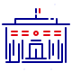 [city-hall.svg](icons/city-hall.svg) ·  [contract.svg](icons/contract.svg) · 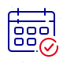 [calendar.svg](icons/calendar.svg) | Frise chronologique `votes` / `questions` / `rapports` / `débats`. |
| 8 - Score d'alignement |  [compass.svg](icons/compass.svg) |  [money.svg](icons/money.svg) · 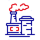 [factory.svg](icons/factory.svg) ·  [data-visualization.svg](icons/data-visualization.svg) | Radar ou quadrant budget / signaux terrain. |
| 9 - Vision | 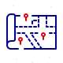 [map.svg](icons/map.svg) |  [environment.svg](icons/environment.svg) · 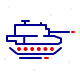 [army-tank.svg](icons/army-tank.svg) ·  [location-france.svg](icons/location-france.svg) | Carte de France en couches : budget, emploi, brevets, mentions. |
| 10 - Prochaines étapes | 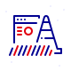 [in-progress.svg](icons/in-progress.svg) | 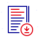 [document-download.svg](icons/document-download.svg) ·  [search.svg](icons/search.svg) · 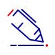 [conclusion.svg](icons/conclusion.svg) | Roadmap en 3 colonnes avec checklist et niveau de maturité. |

## Liens utiles à placer dans la slide d'introduction

* **Site Minerve** : lien à renseigner quand le domaine final est fixé.
* **Minerve DataSet** : [https://minerve.onrender.com](https://minerve.onrender.com)
* **Repository GitHub - Site** : lien à renseigner quand le repo final est fixé.
* **Repository GitHub - Dataset** : lien à renseigner quand le repo final est fixé.
